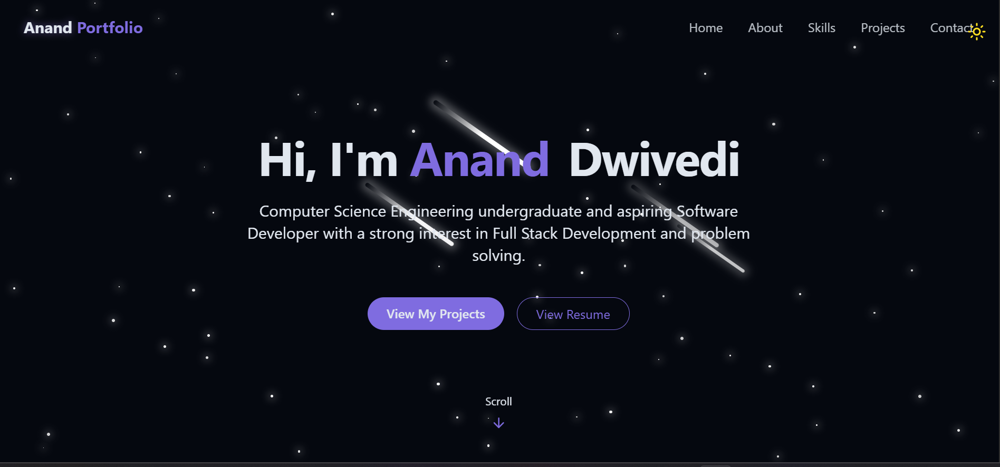

Great, you want to **convert a template README into a personal portfolio README** 👍
Below is a **clean, recruiter-friendly, personalized README** for **your portfolio** (not a tutorial, not YouTube-focused).

You can **copy–paste this directly** into your `README.md`.

---

# 🚀 Anand Dwivedi | Developer Portfolio

<div align="center">
  <br />
  <a href="https://youtu.be/YOUR_VIDEO_ID" target="_blank">
    
  </a>
  <br />
  <div>
    
    
    
    
    
  </div>

  <h3 align="center">
    A modern, responsive developer portfolio showcasing my skills, projects, and experience
  </h3>

  <p align="center">
    <a href="portfolio-two-mauve-dtxcltaupa.vercel.app" target="_blank"><b>Live Demo</b></a> •
    <a href="https://github.com/mranand2004" target="_blank"><b>GitHub</b></a> •
    <a href="https://drive.google.com/file/d/1g4Z4s1QKhh1_FKzpjDXOt3F_aoYT7meF/view" target="_blank"><b>Resume</b></a>
  </p>
</div>

---

## 📌 About the Project

This is my **personal portfolio website**, built to showcase my:

* Technical skills
* Real-world projects
* Problem-solving ability
* Frontend & full-stack development experience

The portfolio focuses on **clean UI**, **smooth animations**, **dark mode**, and **mobile responsiveness**, making it recruiter-friendly and production-ready.

---

## ⚙️ Tech Stack

* **React** – Component-based UI development
* **Vite** – Fast build tool and dev server
* **Tailwind CSS** – Utility-first styling
* **GSAP** – High-performance animations
* **Lucide Icons** – Modern icon set
* **Git & GitHub** – Version control
* **Vercel** – Deployment

---

## ✨ Features

* 🌙 **Dark Mode UI**
* 🎬 **GSAP Animations & Page Transitions**
* 📱 **Fully Responsive Design**
* 👨‍💻 **Hero & About Sections**
* 🧠 **Skills & Tech Stack Overview**
* 🗂️ **Projects Showcase with Live Links**
* 📄 **Resume View via Google Drive**
* 📩 **Contact Section with Social Links**

---

## 🧑‍💻 About Me

I am a **Computer Science Engineering undergraduate at Chandigarh University** with a strong foundation in:

* Data Structures & Algorithms
* Object-Oriented Programming
* Full Stack Web Development (MERN)
* Problem Solving & System Thinking

I enjoy building **scalable, user-focused web applications** and continuously improving my development skills.

---

## 🚀 Getting Started (Local Setup)

### Prerequisites

* Node.js
* Git

### Run Locally

```bash
git clone https://github.com/mranand2004/Portfolio.git
cd Portfolio
npm install
npm run dev
```

Open in browser:

```
http://localhost:5173
```

---

## 🖼️ Screenshots

> Add screenshots of:

* Hero section
* Projects section
* About section
* Contact section

(Recommended for recruiters)

---

## ☁️ Deployment

This project is deployed using **Vercel**.

### Deploy Your Own Version

1. Fork or clone this repository
2. Push to GitHub
3. Go to [vercel.com](https://vercel.com)
4. Import repository → Deploy

---

## 🔗 Links

* **Live Portfolio:** [portfolio-two-mauve-dtxcltaupa.vercel.app](https://your-vercel-link.vercel.app)
* **GitHub:** [https://github.com/mranand2004](https://github.com/mranand2004)
* **Resume:** [https://drive.google.com/file/d/1g4Z4s1QKhh1_FKzpjDXOt3F_aoYT7meF/view](https://drive.google.com/file/d/1g4Z4s1QKhh1_FKzpjDXOt3F_aoYT7meF/view)

---

## 📬 Contact

Feel free to connect with me for:

* Internships
* Full-time roles
* Freelance opportunities
* Collaboration

📧 Email: *add your email here*
💼 LinkedIn: *add LinkedIn link*

---

### ⭐ If you like this portfolio, feel free to star the repo!
